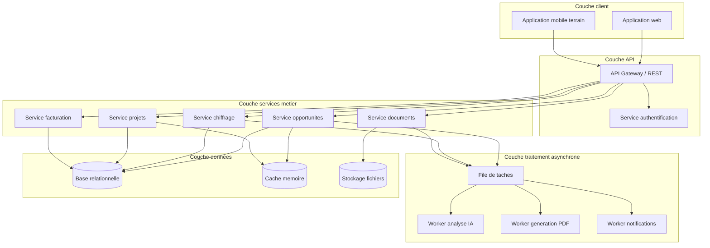
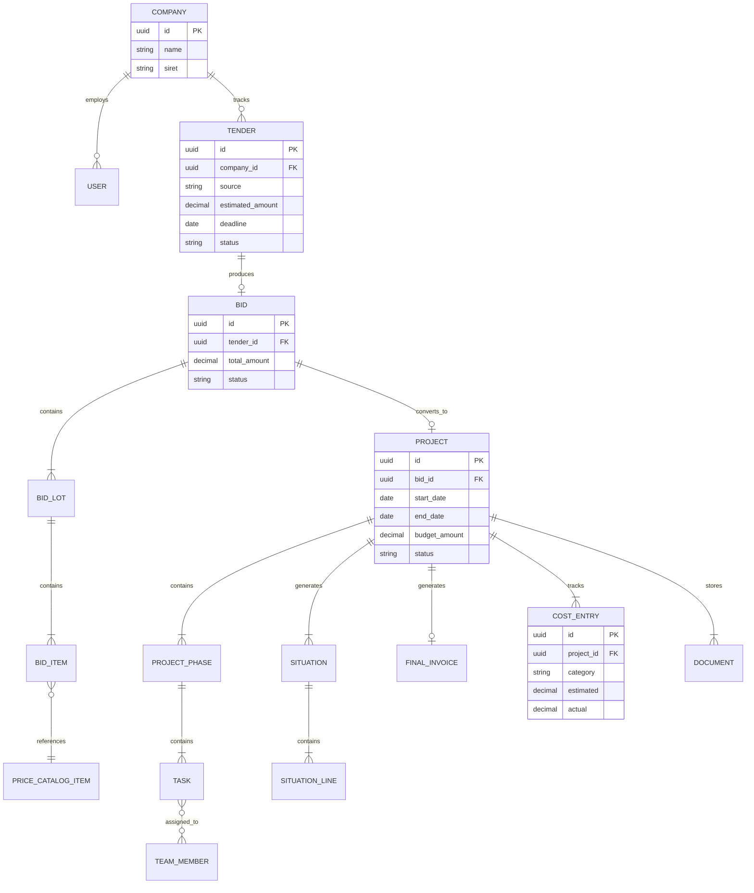
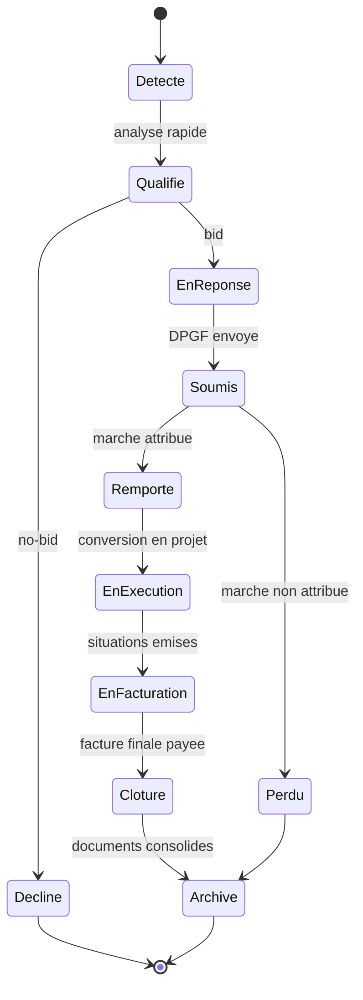
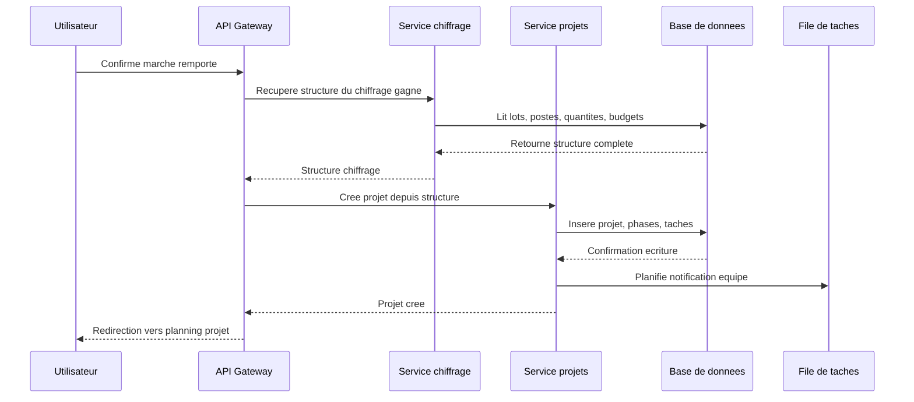
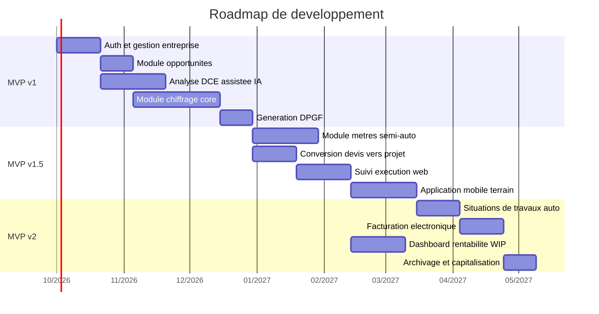

# Plateforme BTP Full-Stack — Spécification technique

## Document de référence pour l'implémentation

Ce document liste, pour chaque brique fonctionnelle du produit, les exigences techniques nécessaires à une implémentation complète. Il est le pendant technique du document `README_BESOIN_METIER.md`, qui explique le *pourquoi* de chaque fonctionnalité ; ce document explique le *comment*.

---

## 1. Architecture générale du système

### 1.1 Vue d'ensemble

Le système est découpé en cinq couches : client, API, services métier, traitement asynchrone, données. Cette séparation permet de faire évoluer indépendamment l'interface, la logique métier et les traitements lourds (analyse IA, génération de documents), qui ne doivent jamais bloquer une requête utilisateur.



### 1.2 Stack technique recommandée

| Couche | Technologie recommandée | Justification |
|---|---|---|
| Backend / API | Django + Django REST Framework | Écosystème mature, ORM robuste, admin auto-généré utile en phase MVP |
| Base de données | PostgreSQL | Support JSON natif pour les documents structurés (CCTP parsé), transactions fiables |
| Traitement asynchrone | Celery + Redis | File de tâches pour les traitements longs (parsing IA, génération PDF) sans bloquer l'API |
| Cache | Redis | Mutualisé avec le broker Celery, réduction de charge sur PostgreSQL pour les lectures fréquentes |
| Stockage fichiers | Stockage objet compatible S3 | Plans, PDF de DCE, photos de chantier — volumétrie croissante à ne pas stocker en base |
| Frontend web | Application web réactive (SPA ou hybride SSR) | Nécessaire pour les interactions complexes (métré sur plan, planning drag-and-drop) |
| Mobile terrain | Application mobile native ou web responsive avec mode dégradé hors-ligne | Usage en conditions de chantier, connectivité parfois faible |
| IA / extraction documentaire | Modèle de langage via API + OCR pour les PDF scannés | Analyse du DCE, suggestion de prix, détection d'articles manquants |
| Génération de documents | Bibliothèque de génération PDF côté serveur | DPGF, situations, factures conformes |

### 1.3 Principe directeur : unicité de la donnée

Chaque donnée métier (une quantité, un prix, une affectation d'équipe) doit avoir **une seule source de vérité** dans le modèle de données, quelle que soit la phase du cycle de vie où elle a été créée. Le module Exécution ne recrée pas ses propres lots et postes : il référence ceux créés au moment du chiffrage. Cette contrainte structure directement le modèle de données présenté ci-dessous.

---

## 2. Modèle de données

### 2.1 Entités principales et relations



### 2.2 Description des entités clés

**COMPANY** — L'entreprise cliente de la plateforme (tenant). Toute donnée du système est rattachée directement ou indirectement à une `COMPANY`. Architecture multi-tenant à prévoir dès la conception (isolation stricte des données entre entreprises clientes).

**TENDER** (opportunité) — Une opportunité détectée en phase 1, avant décision de réponse. Statuts attendus : `nouvelle`, `qualifiee`, `declinee`, `en_reponse`.

**BID** (offre) — La réponse construite en phase 2, rattachée à un `TENDER`. Contient la structure en lots et postes qui sera reprise telle quelle par le `PROJECT` en cas de victoire.

**BID_LOT** et **BID_ITEM** — Décomposition hiérarchique de l'offre, reflétant la structure du CCTP (lot > poste). C'est cette hiérarchie qui doit rester strictement identique entre le chiffrage, le DPGF exporté, et plus tard le planning d'exécution et les situations de travaux.

**PRICE_CATALOG_ITEM** — La bibliothèque de prix propre à l'entreprise (voir section 4.3). Un `BID_ITEM` référence un `PRICE_CATALOG_ITEM` lorsque le prix provient du catalogue, ou porte un prix ad hoc sinon.

**PROJECT** — Créé automatiquement à la bascule d'un `BID` en statut gagné (voir section 5.1). Porte le budget de référence hérité du chiffrage.

**PROJECT_PHASE** et **TASK** — Décomposition du projet en phases d'exécution, dérivées des `BID_LOT`. Une tâche peut être assignée à un ou plusieurs membres d'équipe (`TEAM_MEMBER`).

**COST_ENTRY** — Enregistrement des coûts réels par catégorie et par phase, permettant la comparaison estimé/réel qui alimente le dashboard de rentabilité (voir section 6.3).

**SITUATION** et **SITUATION_LINE** — Facturation intermédiaire, générée à partir de l'avancement des `TASK` (voir section 7.1).

**DOCUMENT** — Toute pièce versée au dossier projet (DCE original, plans, photos, PDF générés), avec métadonnées de type et de phase d'origine, pour l'archivage final (voir section 8).

### 2.3 Contraintes d'intégrité à implémenter

- Un `PROJECT` ne peut être créé que depuis un `BID` dont le statut est passé à `remporte` — jamais créé manuellement de façon déconnectée, afin de garantir la reprise automatique du budget et de la structure.
- La somme des montants des `SITUATION_LINE` cumulées ne peut jamais dépasser le montant du `BID_ITEM` correspondant, sauf validation explicite d'un avenant.
- Un `TASK` ne peut être marqué comme terminé que si son `PROJECT_PHASE` parent est en statut actif (contrôle de cohérence du workflow).

---

## 3. Machine à états du cycle de vie

### 3.1 États et transitions

Chaque `TENDER`/`BID`/`PROJECT` transite selon un cycle d'état unique, qui doit être implémenté comme une machine à états explicite (et non comme un simple champ texte libre), afin de garantir qu'aucune transition invalide n'est possible (par exemple : passer directement de `Detecte` à `EnExecution` sans phase de réponse).



### 3.2 Règles d'implémentation

- Chaque transition doit être exposée comme une action explicite de l'API (`POST /tenders/{id}/qualify`, `POST /bids/{id}/submit`), jamais comme une simple mise à jour de champ via `PATCH` générique, afin de pouvoir déclencher les effets de bord associés (voir 3.3).
- Toute tentative de transition non prévue dans le diagramme doit être rejetée par l'API avec une erreur explicite.
- L'historique complet des transitions (horodatage, utilisateur, état source, état cible) doit être conservé pour audit et pour alimenter les statistiques de taux de conversion (utile en phase 1 pour le scoring des opportunités, voir 4.1).

### 3.3 Effets de bord par transition

| Transition | Effet de bord à déclencher |
|---|---|
| `Qualifie` → `EnReponse` | Verrouillage de l'estimation de charge, réservation indicative de capacité |
| `Soumis` → `Remporte` | Déclenchement automatique de la création du `PROJECT` (voir section 5.1) |
| `EnExecution` → `EnFacturation` | Génération de la première situation si des tâches sont déjà closes |
| `EnFacturation` → `Cloture` | Vérification que la facture finale est marquée payée avant d'autoriser la transition |
| `Cloture` → `Archive` | Déclenchement du calcul de rentabilité finale (voir section 8.2) et gel des données du projet en lecture seule |

---

## 4. Phase 1 — Module Détection et qualification d'opportunité

### 4.1 Fonctionnalités à implémenter

**4.1.1 Agrégation multi-sources**
- Connecteurs d'import pour les sources d'opportunités : import manuel (saisie ou email transféré), import par flux structuré si la source le permet, saisie directe depuis un formulaire de sollicitation privée.
- Modèle `TENDER` unique quelle que soit la source, avec un champ `source` et un champ `source_reference` pour la traçabilité.
- Déduplication : détection d'opportunités déjà importées (même objet, même maître d'ouvrage, dates proches) pour éviter les doublons.

**4.1.2 Extraction automatique des métadonnées**
- Traitement asynchrone (worker dédié) déclenché à l'import d'un document d'opportunité : extraction du montant estimé, de la date limite de réponse, de la nature des travaux, de la localisation.
- Cette extraction utilise le même moteur d'analyse documentaire que le module d'analyse du DCE (section 5.1) — mutualisation à prévoir dans l'architecture pour éviter la duplication de logique.

**4.1.3 Aide à la décision bid/no-bid**
- Calcul d'un score de qualification combinant : charge de réponse estimée (à partir de la complexité détectée du dossier), disponibilité de capacité de production sur la période concernée (croisement avec le planning des projets en cours), taux de réussite historique sur des opportunités de nature similaire.
- Interface de décision présentant ce score avec le détail de son calcul (jamais une boîte noire), pour que l'utilisateur garde la main sur la décision finale.

**4.1.4 Historique et apprentissage**
- Conservation de toutes les décisions bid/no-bid et de leur issue (gagné, perdu, décliné) dans une table dédiée, utilisée pour recalculer périodiquement les taux de réussite par catégorie de projet (taille, type de travaux, type de maître d'ouvrage).

### 4.2 Modèle de données spécifique

```
TENDER
  - id, company_id, source, source_reference
  - title, description, estimated_amount
  - deadline, location, nature_of_work
  - qualification_score, status
  - created_at, qualified_at

TENDER_DECISION_LOG
  - id, tender_id, decision, decided_by
  - estimated_workload_hours, available_capacity_hours
  - historical_win_rate_snapshot
  - decided_at
```

### 4.3 Points d'attention techniques

- Le calcul de disponibilité de capacité nécessite une lecture croisée avec le module Exécution (section 6) : la charge des équipes sur les projets déjà en cours doit être accessible en lecture rapide, ce qui justifie une mise en cache de l'agenda de capacité plutôt qu'un recalcul à chaque requête.
- Le score de qualification ne doit jamais être calculé de façon synchrone bloquante sur l'import : il s'agit d'un traitement asynchrone qui met à jour l'objet `TENDER` une fois terminé, avec notification à l'utilisateur.

---

## 5. Phase 2 — Module Réponse à l'appel d'offre

Ce module regroupe quatre sous-fonctionnalités qui doivent être conçues comme un pipeline continu : la sortie de chaque étape est l'entrée de la suivante, sans ressaisie manuelle intermédiaire.

### 5.1 Analyse du dossier de consultation (DCE)

**Fonctionnalités à implémenter**
- Import multi-fichiers (PDF texte, PDF scanné, formats bureautiques) avec détection automatique du type de document (CCTP, règlement de consultation, plans, bordereau de prix, annexes).
- Pipeline d'extraction : OCR pour les documents scannés, puis extraction assistée par modèle de langage pour identifier les champs structurants (délais, critères de sélection et pondération, contraintes techniques, clauses de risque, exigences de qualification).
- Génération d'une fiche de lecture synthétique structurée (et non un simple résumé en texte libre), stockée en tant qu'objet consultable et modifiable par l'utilisateur, jamais en écrasement silencieux d'une correction manuelle.
- Détection des exigences de qualification (labels, habilitations) avec comparaison au profil de qualification de l'entreprise, pour signaler une éventuelle inéligibilité avant d'engager du temps de réponse.
- Lorsque le DCE contient un bordereau de prix ou un DQE déjà structuré, extraction automatique de la hiérarchie lots/postes et des quantités pour pré-remplir le module de chiffrage (voir 5.3).

**Modèle de données spécifique**
```
DCE_DOCUMENT
  - id, tender_id, file_reference, document_type
  - ocr_status, extraction_status

DCE_ANALYSIS
  - id, tender_id
  - selection_criteria (structure ponderee)
  - key_deadlines, risk_clauses
  - qualification_requirements
  - extracted_lots_structure (reference vers BID_LOT provisoires)
  - reviewed_by_user (booleen)
```

**Points d'attention techniques**
- L'extraction par modèle de langage doit produire une sortie strictement structurée (schéma de données validé), jamais du texte libre à reparser côté client.
- Le traitement étant potentiellement long (plusieurs dizaines de secondes pour un DCE volumineux), l'interface doit permettre un traitement en tâche de fond avec notification de fin, sans bloquer l'utilisateur sur cet écran.
- Toute donnée extraite automatiquement doit rester éditable par l'utilisateur, avec un indicateur visuel distinguant donnée extraite automatiquement / donnée validée manuellement — la confiance dans l'IA ne doit jamais être absolue sur un document contractuel.

### 5.2 Métrés (relevé de quantités)

**Fonctionnalités à implémenter**
- Visualiseur de plans PDF avec outils de traçage : mesure de longueur, mesure de surface, comptage d'éléments ponctuels, avec calcul d'échelle à partir d'une cotation de référence sur le plan ou d'une échelle déclarée.
- Association de chaque élément tracé à un poste du chiffrage (lot / poste hérité de l'analyse DCE si disponible, ou saisi manuellement sinon).
- Export structuré des quantités relevées, alimentant directement le module de chiffrage sans ressaisie.
- Fonction de comparaison avec des projets historiques de nature similaire (même type de travaux, surface comparable) pour signaler un écart significatif pouvant indiquer un oubli.

**Modèle de données spécifique**
```
TAKEOFF_MEASUREMENT
  - id, bid_id, plan_document_id
  - bid_item_id (poste associe)
  - measurement_type (longueur, surface, comptage)
  - value, unit
  - geometry_reference (coordonnees sur le plan, pour rappel visuel)
```

**Points d'attention techniques**
- Le rendu et l'interaction sur plan PDF (zoom, calque de traçage superposé) est une fonctionnalité front-end exigeante : prévoir une bibliothèque de rendu PDF performante côté client plutôt qu'un rendu serveur, pour garder l'interaction fluide.
- La comparaison historique nécessite une indexation par caractéristiques de projet (type de travaux, surface totale) pour permettre une recherche de similarité rapide, à concevoir dès le schéma de données plutôt qu'en ajout tardif.

### 5.3 Chiffrage

C'est le module central du produit, celui qui porte la plus forte valeur métier et qui doit recevoir le plus haut niveau de soin technique.

**Fonctionnalités à implémenter**
- **Modèles de prix configurables** : implémentation d'au moins quatre stratégies de calcul de prix par poste — taux horaire, prix forfaitaire, prix au m² ou à l'unité, déboursé sec avec coefficients de frais généraux et de marge. Le modèle de prix est configuré au niveau de l'entreprise, avec possibilité de surcharge ponctuelle par poste.
- **Bibliothèque de prix propre à l'entreprise** (`PRICE_CATALOG_ITEM`) : structure hiérarchique (catégorie, sous-catégorie, article), alimentée manuellement, par import, ou automatiquement à chaque nouveau chiffrage validé (le prix appliqué sur un chantier réel vient enrichir la bibliothèque pour les chiffrages futurs).
- **Mise en correspondance assistée CCTP → catalogue** : pour chaque poste extrait du CCTP (voir 5.1), suggestion des articles de catalogue les plus proches par similarité textuelle, avec possibilité de créer un nouvel article catalogue à la volée si aucune correspondance n'existe.
- **Application automatique des règles de marge** : moteur de calcul appliquant les coefficients configurés (par exemple marge différenciée main-d'œuvre / matériaux) à chaque poste, avec traçabilité du calcul (déboursé sec affiché séparément du prix de vente).
- **Historisation des prix** : chaque modification de prix dans le catalogue est versionnée (date, ancienne valeur, nouvelle valeur), permettant de reconstituer le prix appliqué à une date donnée et d'analyser les tendances de coût.
- **Contrôle de complétude** : à la validation du chiffrage, vérification automatique que chaque poste identifié dans le CCTP dispose d'un prix associé ; blocage ou avertissement explicite en cas d'écart.

**Modèle de données spécifique**
```
PRICE_CATALOG_ITEM
  - id, company_id, category, label
  - pricing_model (hourly, lump_sum, per_unit, cost_plus_margin)
  - base_cost, margin_coefficient
  - unit

PRICE_CATALOG_ITEM_HISTORY
  - id, price_catalog_item_id
  - previous_value, new_value, changed_at

BID_ITEM
  - id, bid_lot_id, price_catalog_item_id (nullable)
  - description, quantity, unit
  - unit_price, total_price
  - pricing_model_used
  - completeness_checked (booleen)
```

**Points d'attention techniques**
- Le moteur de calcul de prix (application des coefficients de marge) doit être isolé dans un service dédié et testé unitairement de façon exhaustive : une erreur d'arrondi ou de coefficient sur ce module a un impact financier direct sur l'entreprise cliente.
- La suggestion de correspondance CCTP → catalogue peut s'appuyer sur une recherche de similarité textuelle (recherche vectorielle ou recherche plein texte pondérée) : prévoir l'indexation appropriée dès la conception du schéma plutôt qu'en optimisation tardive.
- Le contrôle de complétude doit comparer strictement le nombre de postes extraits du CCTP au nombre de postes chiffrés, poste par poste (et non seulement une comparaison de montant total), pour détecter un oubli même compensé par ailleurs.

### 5.4 Constitution de la réponse financière (DPGF)

**Fonctionnalités à implémenter**
- Génération automatique du document de réponse financière à partir de la structure `BID_LOT` / `BID_ITEM` du chiffrage, dans un format respectant la structure attendue par le dossier de consultation (mapping configurable si la structure imposée diffère de la structure interne de chiffrage).
- Contrôles de cohérence pré-export : tous les postes attendus sont-ils chiffrés, les totaux par lot correspondent-ils à la somme des postes, les variantes demandées sont-elles toutes traitées.
- Export dans les formats requis (document PDF signé électroniquement le cas échéant, fichier tableur structuré).

**Modèle de données spécifique**
```
BID_EXPORT
  - id, bid_id, export_format
  - generated_at, generated_by
  - file_reference
  - consistency_check_passed (booleen)
  - consistency_check_details (liste des anomalies detectees)
```

**Points d'attention techniques**
- La génération de document doit être un traitement asynchrone (potentiellement plusieurs secondes pour un DPGF volumineux avec mise en forme complexe), avec statut consultable côté interface.
- Conserver une trace immuable du document généré et transmis (le PDF exact envoyé au maître d'ouvrage), même si le chiffrage sous-jacent est modifié ultérieurement — nécessaire en cas de litige contractuel.

### 5.5 Séquence complète du pipeline de réponse



---

## 6. Phase 3 — Module Exécution et suivi de chantier

### 6.1 Conversion automatique devis → projet

**Fonctionnalités à implémenter**
- Déclenchement automatique à la transition `Soumis` → `Remporte` (voir section 3.3) : création d'un `PROJECT`, de ses `PROJECT_PHASE` (une par `BID_LOT`) et de ses `TASK` (une par `BID_ITEM` ou regroupement configurable), avec reprise intégrale des quantités et budgets du chiffrage.
- Aucune ressaisie manuelle : l'utilisateur peut ajuster la structure proposée (fusionner des tâches, ajuster des dates) mais part toujours d'une structure pré-remplie.

### 6.2 Planification et affectation des ressources

**Fonctionnalités à implémenter**
- Vue planning (type diagramme de Gantt ou calendrier par équipe) permettant l'affectation de membres d'équipe ou de sous-traitants à chaque `TASK`.
- Détection de conflit d'affectation : alerte si un membre d'équipe est affecté simultanément sur deux tâches de deux projets différents sur une même période.
- Vue de charge consolidée par équipe et par période, réutilisée par le module de qualification d'opportunité (section 4.1.3) pour évaluer la disponibilité de capacité.

**Modèle de données spécifique**
```
PROJECT_PHASE
  - id, project_id, bid_lot_id (origine)
  - label, planned_start, planned_end
  - status

TASK
  - id, project_phase_id, bid_item_id (origine)
  - label, planned_hours, status
  - completed_at, completion_evidence_id (photo)

TASK_ASSIGNMENT
  - id, task_id, team_member_id
  - assigned_hours, actual_hours
```

### 6.3 Suivi terrain mobile

**Fonctionnalités à implémenter**
- Interface mobile simplifiée à trois actions principales : consulter les tâches du jour, marquer une tâche comme terminée (avec ajout de photo et commentaire libre optionnel), signaler un incident ou un blocage.
- Fonctionnement en mode dégradé hors connexion : les actions sont mises en file locale sur l'appareil et synchronisées dès que la connectivité revient, avec gestion des conflits si la même tâche a été modifiée entretemps depuis une autre source.
- Capture photo directement liée à la tâche, stockée et associée au dossier documentaire du projet (voir section 8.1).

**Points d'attention techniques**
- La synchronisation hors-ligne est la contrainte technique la plus exigeante de ce module : privilégier une architecture de synchronisation par événements horodatés (plutôt qu'un simple écrasement de dernière valeur) pour gérer proprement les conflits de mise à jour concurrente.
- L'application mobile doit rester utilisable avec une connexion très faible ou intermittente (contexte de chantier) : minimiser le poids des échanges réseau, compresser les photos avant envoi.

### 6.4 Suivi budgétaire et alertes proactives

**Fonctionnalités à implémenter**
- Saisie ou import des coûts réels engagés (temps passé par équipe converti en coût, factures fournisseurs, factures sous-traitants), rattachés à une phase de projet (`COST_ENTRY`).
- Calcul continu de l'écart entre coût estimé (hérité du chiffrage) et coût réel engagé, par phase et consolidé au niveau du projet.
- Moteur d'alerte configurable (seuil d'écart en pourcentage ou en valeur) déclenchant une notification lorsque : une phase dépasse son budget prévisionnel, un retard de planning menace l'affectation d'une équipe sur un autre projet.

**Modèle de données spécifique**
```
COST_ENTRY
  - id, project_id, project_phase_id
  - category (main_oeuvre, materiaux, sous_traitance)
  - estimated_amount, actual_amount
  - recorded_at, source (saisie_manuelle, import_facture, calcul_pointage)

ALERT_RULE
  - id, company_id, rule_type, threshold_value
ALERT_INSTANCE
  - id, alert_rule_id, project_id
  - triggered_at, resolved_at, message
```

**Points d'attention techniques**
- Le calcul d'écart doit être recalculé de façon incrémentale à chaque nouvelle `COST_ENTRY` plutôt que par recalcul complet périodique, pour permettre une alerte quasi temps réel.
- Le moteur d'alerte doit être découplé du calcul métier (pattern observateur ou file d'événements) pour permettre l'ajout futur de nouveaux types de règles sans modifier le cœur du calcul budgétaire.

### 6.5 Journal des réserves et non-conformités

**Fonctionnalités à implémenter**
- Enregistrement des réserves constatées (à la réception ou en cours de chantier), avec statut de levée, photo, et responsable assigné à la résolution.
- Vue consolidée des réserves ouvertes par projet, condition de blocage possible sur la transition vers la facturation finale (configurable par l'entreprise).

---

## 7. Phase 4 — Module Facturation et suivi de paiement

### 7.1 Génération automatique des situations de travaux

**Fonctionnalités à implémenter**
- Calcul du pourcentage d'avancement par lot à partir du statut des `TASK` associées (nombre de tâches terminées rapporté au total, ou avancement pondéré par les heures prévues).
- Génération d'une `SITUATION` pré-remplie reprenant la structure en lots du `BID`, avec le montant cumulé déjà facturé et le montant de la situation courante.
- Application automatique des clauses contractuelles enregistrées au niveau du `BID` : taux de retenue de garantie, montant des acomptes déjà versés, pénalités ou bonifications éventuelles.
- Circuit de validation : la situation générée est un brouillon modifiable, nécessitant une validation explicite de l'utilisateur avant émission (jamais d'envoi automatique sans confirmation humaine sur un document contractuel).

**Modèle de données spécifique**
```
SITUATION
  - id, project_id, situation_number
  - period_start, period_end
  - cumulative_amount, current_amount
  - retention_amount, status (brouillon, validee, envoyee, payee)

SITUATION_LINE
  - id, situation_id, bid_item_id
  - completion_percentage, amount_this_period
  - cumulative_amount
```

### 7.2 Facture finale et conformité électronique

**Fonctionnalités à implémenter**
- Calcul de la facture finale par consolidation des situations émises, ajustée des heures supplémentaires ou avenants validés en cours de chantier, et de la libération de la retenue de garantie selon les conditions contractuelles.
- Génération dans un format conforme à la réglementation de facturation électronique en vigueur, avec passage par une plateforme agréée ou un connecteur compatible.
- Rattachement automatique des pièces justificatives (situations, avenants) à la facture finale pour le dossier d'archivage.

### 7.3 Suivi des encaissements

**Fonctionnalités à implémenter**
- Rapprochement entre les factures émises (situations et facture finale) et les paiements reçus, avec statut par facture (émise, partiellement payée, payée, en retard).
- Système de relance automatique configurable (délai avant première relance, contenu du message, escalade) déclenché par le worker de notifications.

**Modèle de données spécifique**
```
PAYMENT
  - id, invoice_reference, amount, received_at
  - reconciled_with (situation_id ou final_invoice_id)

REMINDER_LOG
  - id, invoice_reference, sent_at, reminder_level
```

---

## 8. Phase 5 — Module Archivage et capitalisation

### 8.1 Dossier projet centralisé

**Fonctionnalités à implémenter**
- Vue documentaire unique par projet regroupant l'ensemble des pièces produites à chaque phase : DCE original, fiche de lecture, chiffrage exporté, DPGF, photos de suivi de chantier, situations, factures.
- Indexation par type de document et par phase d'origine, avec recherche full-text sur le contenu extrait des documents lorsque disponible.

### 8.2 Analyse de rentabilité finale

**Fonctionnalités à implémenter**
- Calcul automatique déclenché à la transition `Cloture` → `Archive` (voir section 3.3) : comparaison du budget chiffré initial et des coûts réels cumulés (`COST_ENTRY`), décomposée par catégorie (main-d'œuvre, matériaux, sous-traitance) et par phase.
- Restitution visuelle de cette analyse (tableau de bord de clôture de projet), incluant la marge finale réalisée en valeur et en pourcentage.

### 8.3 Capitalisation et amélioration continue du chiffrage

**Fonctionnalités à implémenter**
- Traitement périodique (batch) analysant l'ensemble des projets archivés pour détecter des tendances systématiques d'écart entre estimation et réalisation (par exemple : sous-estimation récurrente de la main-d'œuvre sur un type de prestation donné).
- Restitution de ces tendances à l'utilisateur sous forme de suggestions lors des chiffrages futurs (par exemple : majoration suggérée sur un poste identifié comme structurellement sous-évalué), sans jamais appliquer de correction automatique non validée par l'utilisateur.

**Points d'attention techniques**
- Ce traitement d'analyse de tendance est un candidat naturel pour un traitement asynchrone périodique (tâche planifiée) plutôt qu'un calcul en temps réel, la donnée sous-jacente n'évoluant qu'à la clôture de chaque projet.

---

## 9. Roadmap d'implémentation

### 9.1 Séquencement recommandé

L'ordre d'implémentation suit la dépendance fonctionnelle réelle entre modules : le chiffrage doit être solide avant de bâtir la conversion en projet, qui doit elle-même être opérationnelle avant la génération des situations de travaux.



### 9.2 Périmètre détaillé par jalon

**MVP v1 — Fondations et chiffrage (environ 4 mois)**
- Authentification, gestion multi-utilisateurs, gestion du profil entreprise (modèles de prix par défaut).
- Module opportunités : agrégation manuelle, qualification bid/no-bid basique (sans scoring historique, qui nécessite des données pas encore disponibles).
- Analyse DCE assistée par IA : extraction des champs structurants et fiche de lecture.
- Module chiffrage complet : modèles de prix configurables, bibliothèque de prix, contrôle de complétude.
- Génération du DPGF.

*Objectif du jalon : un utilisateur peut recevoir un DCE, le faire analyser, chiffrer une offre complète et exporter un DPGF conforme, sans quitter la plateforme.*

**MVP v1.5 — Exécution (environ 3 mois supplémentaires)**
- Métrés semi-automatiques sur plans.
- Conversion automatique devis gagné → projet structuré.
- Suivi d'exécution en interface web (planning, affectation, avancement).
- Application mobile terrain avec mode hors-ligne.

*Objectif du jalon : un chantier remporté peut être piloté de bout en bout jusqu'à son achèvement opérationnel, avec remontée terrain.*

**MVP v2 — Facturation et pilotage financier (environ 3 mois supplémentaires)**
- Génération automatique des situations de travaux.
- Facturation électronique conforme.
- Dashboard de rentabilité en temps réel (WIP — Work in Progress) exploitant les `COST_ENTRY` déjà collectées depuis le MVP v1.5.
- Archivage et capitalisation.

*Objectif du jalon : couverture complète du cycle de vie appel d'offre → livraison → clôture financière, avec boucle d'amélioration continue du chiffrage.*

### 9.3 Fonctionnalités explicitement hors périmètre initial

Pour ne rien oublier tout en cadrant un MVP réaliste, les éléments suivants sont identifiés comme extensions futures et ne doivent pas bloquer le lancement :

- Intégration BIM (maquette numérique 3D) pour l'extraction automatique de métrés — la version initiale se limite aux plans PDF 2D.
- Connecteurs automatisés vers les plateformes de marchés publics (scraping ou API tierce) — la version initiale repose sur un import semi-manuel des opportunités.
- Marketplace de mise en relation avec des fournisseurs pour la comparaison de prix d'achat en temps réel.
- Signature électronique intégrée des documents contractuels — possibilité d'intégration d'un prestataire tiers spécialisé plutôt que développement interne.

---

## 10. Exigences transverses

### 10.1 Sécurité et isolation des données

- Architecture multi-tenant stricte : toute requête doit être filtrée par `company_id` au niveau de la couche d'accès aux données, jamais uniquement au niveau de l'interface.
- Chiffrement des documents sensibles au repos (DCE, contrats, données financières).
- Journalisation des accès aux documents contractuels et financiers pour audit.

### 10.2 Performance et scalabilité

- Les traitements longs (analyse IA, génération de documents, calculs de rentabilité) doivent systématiquement passer par la file de tâches asynchrones et ne jamais s'exécuter de façon synchrone dans le cycle de requête HTTP.
- Le cache doit être utilisé pour les données consultées fréquemment et modifiées rarement (bibliothèque de prix, structure d'un projet en cours) avec invalidation explicite à chaque écriture.

### 10.3 Qualité et fiabilité

- Le moteur de calcul de prix et de marge (section 5.3) doit faire l'objet d'une couverture de tests unitaires exhaustive, incluant les cas limites (arrondis, coefficients nuls ou négatifs, changement de modèle de prix en cours de chiffrage).
- Toute génération de document contractuel (DPGF, situation, facture) doit être testée en régression visuelle en plus des tests fonctionnels, pour garantir la stabilité de la mise en forme.

### 10.4 Auditabilité

- Toute donnée financière modifiée après validation d'une étape contractuelle (chiffrage validé, situation envoyée) doit être versionnée plutôt qu'écrasée, afin de pouvoir reconstituer l'état exact du document au moment de son envoi au client ou au maître d'ouvrage.

---

## 11. Synthèse des modules et de leurs statuts d'implémentation

| Module | Phase | Complexité technique | Dépendances |
|---|---|---|---|
| Authentification et gestion entreprise | Fondation | Faible | Aucune |
| Agrégation opportunités | 1 | Faible | Fondation |
| Analyse DCE assistée IA | 1 / 2 | Élevée | Fondation, worker IA |
| Qualification bid/no-bid | 1 | Moyenne | Agrégation opportunités, module capacité (phase 3) |
| Métrés semi-automatiques | 2 | Élevée | Analyse DCE |
| Chiffrage | 2 | Élevée | Analyse DCE, métrés |
| Génération DPGF | 2 | Moyenne | Chiffrage |
| Conversion devis → projet | 3 | Moyenne | Chiffrage |
| Planification et affectation | 3 | Moyenne | Conversion devis → projet |
| Suivi terrain mobile | 3 | Élevée | Planification |
| Suivi budgétaire et alertes | 3 | Moyenne | Chiffrage, planification |
| Situations de travaux | 4 | Moyenne | Suivi budgétaire |
| Facture finale et conformité | 4 | Moyenne | Situations de travaux |
| Suivi des encaissements | 4 | Faible | Facture finale |
| Archivage et dossier centralisé | 5 | Faible | Ensemble des modules précédents |
| Analyse de rentabilité finale | 5 | Moyenne | Suivi budgétaire, archivage |
| Capitalisation et amélioration continue | 5 | Élevée | Analyse de rentabilité finale, worker IA |
